# 2D Pose Basic

`2022.7.6` 

## 0. Null

对于单人姿态估计，输入是一个 crop 出来的行人，然后在行人区域位置内找出需要的关键点，比如头部，左手，右膝等。

对于**多人姿态估计**，目前主要有 2 种主流思路，分别是 **top-down** 以及 **bottom-up** 方法。对于 top-down 方法，往往先找到图片中所有行人，然后对每个行人做姿态估计，寻找每个人的关键点。单人姿态估计往往可以被直接用于这个场景。对于 bottom-up，思路正好相反，先是找图片中所有 parts （关键点），比如所有头部，左手，膝盖等，然后把这些 parts（关键点）组装成一个个行人。

 ## 1. Dataset

- [LSP（Leeds Sports Pose Dataset）](https://sam.johnson.io/research/lsp.html)：单人人体关键点检测数据集，关键点个数为14，样本数2K，在目前的研究中作为第二数据集使用。
- [FLIC（Frames Labeled In Cinema）](https://bensapp.github.io/flic-dataset.html)：单人人体关键点检测数据集，关键点个数为9，样本数2W，在目前的研究中作为第二数据集使用。
- [MPII（MPII Human Pose Dataset）](http://human-pose.mpi-inf.mpg.de/)：单人/多人人体关键点检测数据集，关键点个数为16，样本数25K，是单人人体关键点检测的主要数据集。它是 2014 年由马普所创建的，目前可以认为是单人姿态估计中最常用的 benchmark， 使用的是 [PCKh](http://human-pose.mpi-inf.mpg.de/#results) 的指标。
- [MSCOCO](https://cocodataset.org/#home)：多人人体关键点检测数据集，关键点个数为17，样本数量多于30W。目前是多人关键点检测的主要数据集，使用的是 [AP 和 OKS](https://cocodataset.org/#keypoints-eval) 指标。
- [human3.6M](http://vision.imar.ro/human3.6m/description.php)：是 3D 人体姿势估计的最大数据集，由 360 万个姿势和相应的视频帧组成，这些视频帧包含11 位演员从4个摄像机视角执行 15 项日常活动的过程。数据集庞大将近100G。
- [PoseTrack](https://posetrack.net/)：最新的关于人体骨骼关键点的数据集，多人人体关键点跟踪数据集，包含单帧关键点检测、多帧关键点检测、多人关键点跟踪三个人物，多于500个视频序列，帧数超过20K，关键点个数为15。

## 2. Evaluation

### 2.1 pck

(percentage of correct keypoints)
$$
P C K=\frac{\sum_{i} \delta\left(\frac{d_{i}}{d} \leq T\right)}{\sum_{i} 1}
$$
其中：

* `di` 表示第`i`个关节点的预测值和 `groundtruth` 的欧氏距离
* `d` 是一个人体的尺度因子
* 认为当小于阈值`T`时分类正确

### 2.2 oks

(object keypoint similarrity)

一个考虑的**更加全面**的准确性估计方法
$$
O K S_{p}=\frac{\sum_{i} \exp \left\{-d_{p i}^{2} / 2 S_{p}^{2} \sigma_{i}^{2}\right\} \delta\left(v_{p i}=1\right)}{\sum_{i} \delta\left(v_{p i}=1\right)}
$$
其中:

* `p`  表示`groudtruth`中，人的`id`
* i  表示`keypoint`的`id`
* $d_{p i} $ 表示`groudtruth`中每个人和预测的每个人的关键点的欧氏距离
* $S_{p} $  表示当前人的尺度因子，这个值等于此人在 `groundtruth`中所占面积的平方根  $\mathrm{Q}$  ，即  $\sqrt{\left(x_{2}-x_{1}\right)\left(y_{2}-y_{1}\right)} $
* $ \sigma_{i}$   表示第i个骨骼点的归一化因子，这个因子是通过对数据集中所有 `groundtruth`计算的标准差  $\mathrm{Q} $ 而得到的，反映出当前骨骼点标注时候的标准差， $\sigma $ 越大表示这个点越难标注。
* $v_{p i}$  代表第 $ \mathrm{p}  $个人的第 $\mathrm{i} $ 个关键点是否可见
*  $\delta $ 用于将可见点选出来进行计算的函数

### 2.3 AP

(Average Precision)

如果 oks 大于阈值  T  ，则认为该关键点被成功检侧到。

单人姿态估计和多人姿态估计的计算方式不同。对于单人姿态估计的AP， 目标图片中只有一个人体，所以计算方式为:
$$
A P=\frac{\sum_{p} \delta\left(o k s_{p}>T\right)}{\sum_{p} 1}
$$

对于多人姿态估计而言，由于一张图像中有  $\mathrm{M}$  个目标，假设总共预测出 $ \mathrm{N}  $个人体，那么`groundtruth`和预 测值之间能构成一个  `M x N`  的矩阵，然后将每一行的最大值作为该目标的`oks`，则：
$$
A P=\frac{\sum_{m} \sum_{p} \delta\left(o k s_{p}>T\right)}{\sum_{m} \sum_{p} 1}
$$

mAP（mean Average Precision）

顾名思义，AP的均值，具体计算方法就是给定不同的阈值t，计算不同阈值情况下对应的AP，然后求个均值就ok了。

## 3. Conventional Method

传统方法一般是基于图结构和形变部件模型，设计 2D 人体部件检测器，使用图模型建立各部件的连通性，然后结合关键点之间的 pair-wise 关系来恢复人体的姿态。传统方法虽然拥有较高的时间效率，但是提取的都是人工设定的浅层特征（如 HOG，SIFT 等）。可以粗略的把传统方法分成两类。

第一类是直接通过一个全局 feature，把姿态估计问题当成分类或者回归问题直接求解。但是这类方法的问题在于精度一般，并且可能比较适用于背景干净的场景。

第二类是基于一个图模型，比如常用pictorial structure model。一般包含 unary term, 是指对单个 part 进行 feature 的表示，单个 part 的位置往往可以使用DPM (Deformable Part-based model) 来获得。同时需要考虑 pair-wise 关系来优化关键点之间的关联。

总结一下，在传统方法里面，需要关注的两个维度是： feature representation 以及关键点的空间位置关系。特征维度来讲，传统方法一般使用的 HOG, Shape Context, SIFT 等浅层特征。 空间位置关系的表示也有很多形式，上面的 Pictorial structure model 可能只是一种。

## 4. Modern Method

自从 2012 年 AlexNet 开始，深度学习开始快速发展，从最早的图片分类问题，到后来的检测，分割问题。第一次有人在 2014 年成功使用 CNN 来解决单人的姿态估计问题。受限于当时的时代背景，整体网络结构比较简单并且同时也沿用了传统思路：首先是通过滑动窗口的方式，来对每个 patch 进行分类，找到相应的人体关键点。

2014 年的另外一个重要的进展是引入了 `MPII` 的数据集。此前的大部分 paper 都是基于 FLIC 以及 LSP 来做评估的，但是在深度学习时代，数据量还是相对偏少（K 级别）。MPII 把数据量级提升到 W 级别，同时因为数据是互联网采集，同时是针对 activity 来做筛选的，所以无论从难度还是多样性角度来讲，都比原来的数据集有比较好的提升。

现在几乎所有的主流方法都是围绕着下面两大块进行的：改善监督信息和网络结构。

### 4.1 改善监督信息

**基于坐标回归**

关键点：直接将关键点二维坐标当做groundtruth进行训练

**Deep pose：**

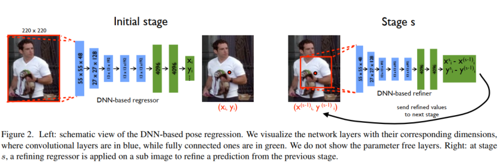

global and local

Cascade of Pose Regressors  
$$
\text { Stage 1: } \quad \mathbf{y}^{1} \leftarrow N^{-1}\left(\psi\left(N\left(x ; b^{0}\right) ; \theta_{1}\right) ; b^{0}\right)
$$

$$
Stage  s: \quad \mathbf{y}_{i}^{s} \leftarrow \mathbf{y}_{i}^{(s-1)}+N^{-1}\left(\psi_{i}\left(N(x ; b) ; \theta_{s}\right) ; b\right)
$$

$$

\begin{array}{c}
\text { for } b=b_{i}^{(s-1)} \\
b_{i}^{s} \leftarrow\left(\mathbf{y}_{i}^{s}, \sigma \operatorname{diam}\left(\mathbf{y}^{s}\right), \sigma \operatorname{diam}\left(\mathbf{y}^{s}\right)\right)
\end{array}
$$

b表示bounding box

参考：

https://zhuanlan.zhihu.com/p/424166966

https://blog.csdn.net/u014625530/article/details/85010882

**基于热图检验**

`Heatmap` 将每个骨骼节点的坐标分别都用一个概率图来表示，这个概率图的分辨率往往是原图的等比例缩放图（一般为 64x48），`channel` 的个数等于关键节点的数目。

`heatmap`的`ground truth`是**以关键点为中心的二维高斯分布**（高斯核大小为超参）

关于`heat map`的知识：

https://zhuanlan.zhihu.com/p/388024445

https://zhuanlan.zhihu.com/p/92417329

**Joint Training of a Convolutional Network and a Graphical Model for Human Pose Estimation**

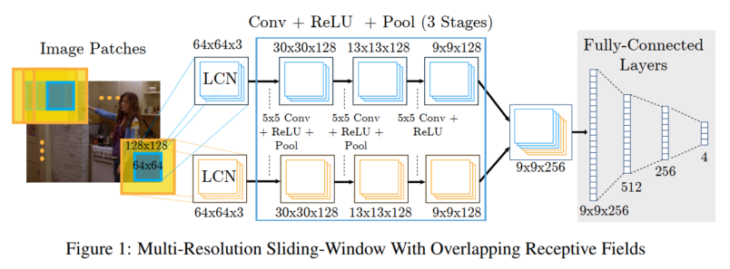

* multi-resolution input with overlapping receptive fields  
* drawback is that evaluation is expensive due to redundant convolutions  

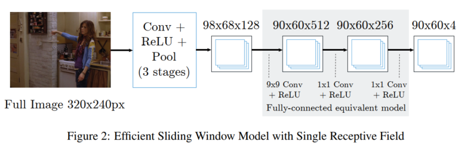

* the output heat-map will be a lower resolution than the input image.  

直接将原始图片传进了卷积神经网络，之后进行卷积核的滑窗，来产生 feature map

这样做的好处在于减少了计算量，但是也有坏处，因为是在全图上做一个感受野的缩放。那么对于我最后得到的 feature map而言，我关节点热度图的信息（分辨率）会过于的小，以至于会造成定位的偏差。

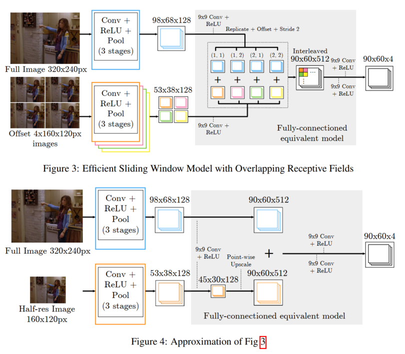

* combine an efficient sliding window-based architecture with multiresolution and overlapping receptive fields  

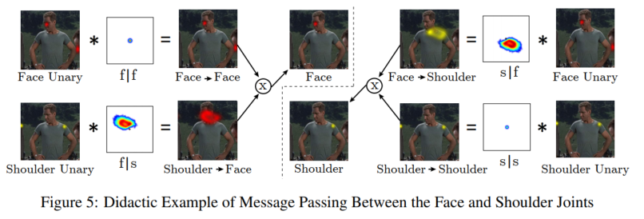

之后用了MKF(马尔科夫随机场)（没咋看懂了）

假设身体部位B位于中心 像素处，则卷积先验  $P_{A \mid B}(i, j) $ 是身体部位A出现在像素位置  $(i, j) $ 的可能性。对于身体部位  A  ，作者将最终边际可能性  $\tilde{p}_{A}  $计算为:
$$
\tilde{p}_{A}=\frac{1}{Z} \Pi_{v \in V}\left(p_{A} \mid v * p_{v}+b_{v \rightarrow A}\right)
$$

### 4.2 改善网络结构

**Stacked hourglass network：**

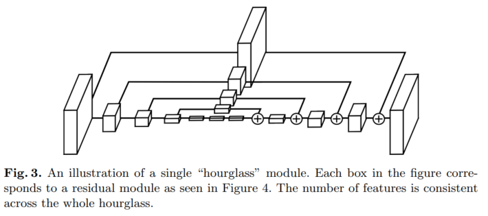

降采样，然后上采样

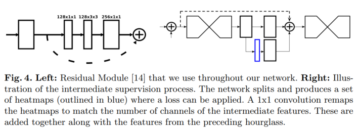

**res block**

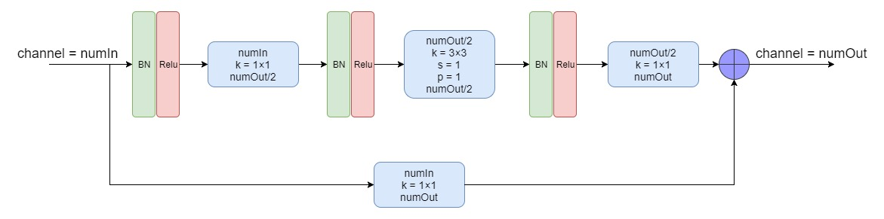

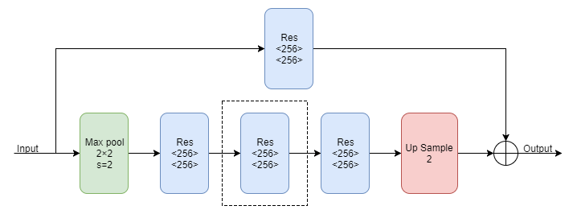

**hourglass module**

**Stacked Hourglass Network**

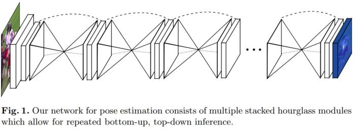

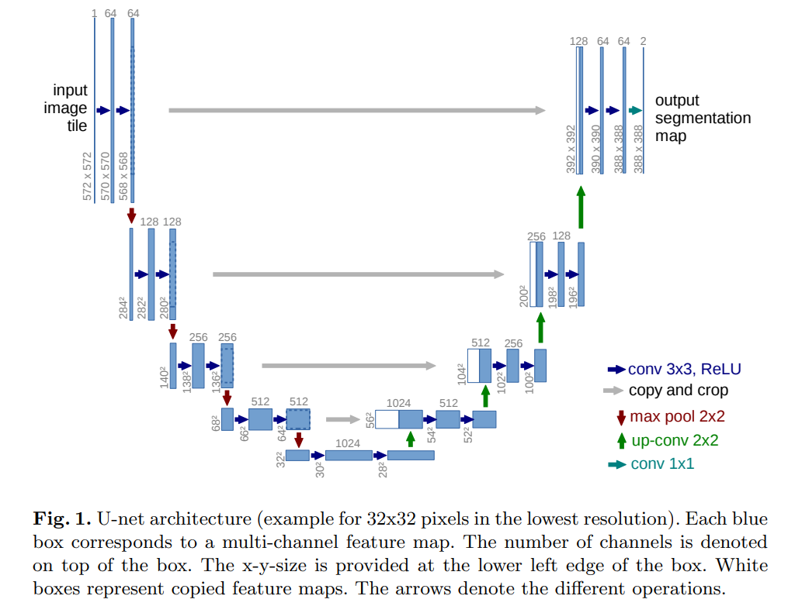

**Intermediate Supervision（中间监督）**

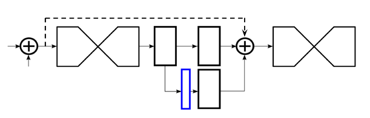

防止vanishing gradient

参考：

https://zhuanlan.zhihu.com/p/45002720

参考：

https://yunyang1994.gitee.io/2020/10/10/2D%E4%BA%BA%E4%BD%93%E5%A7%BF%E6%80%81%E4%BC%B0%E8%AE%A1%E7%9A%84%E6%80%BB%E7%BB%93%E5%92%8C%E6%A2%B3%E7%90%86/

https://zhuanlan.zhihu.com/p/48601321

论文就略了
