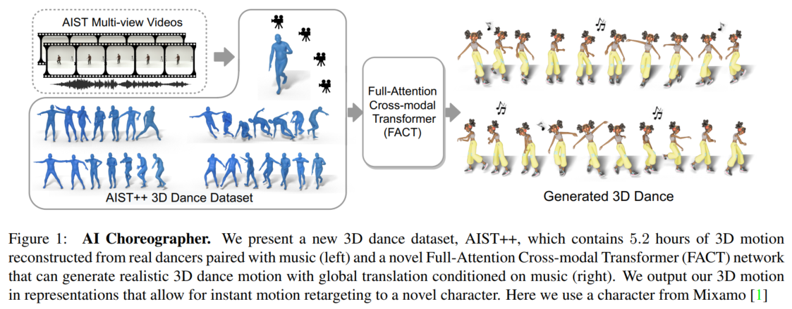
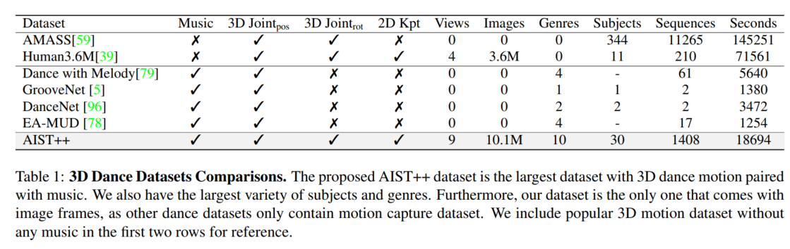
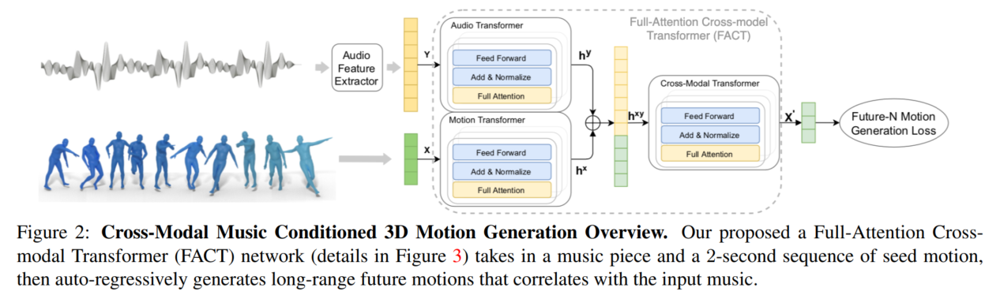
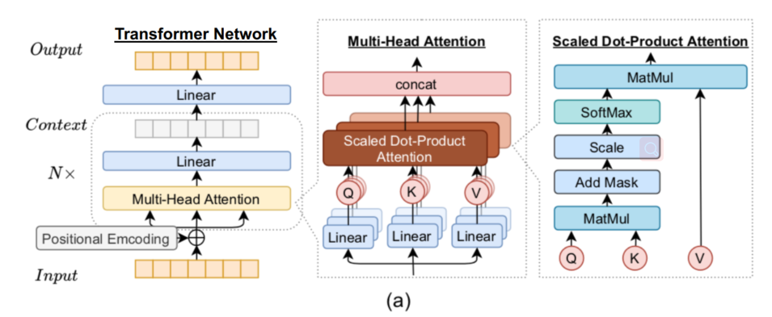
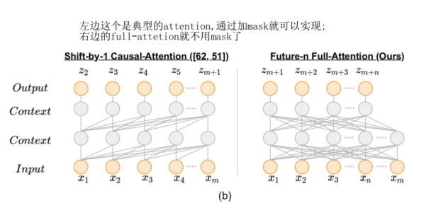
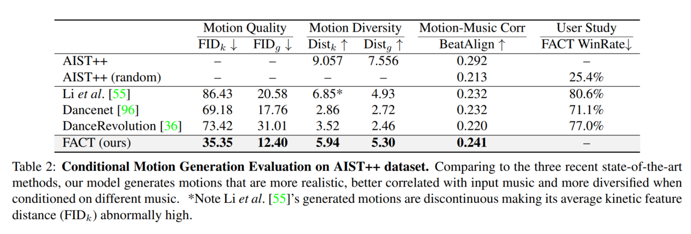
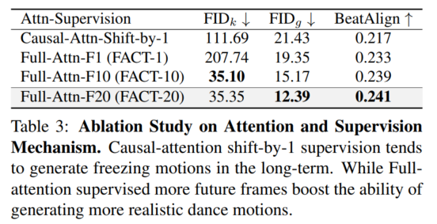
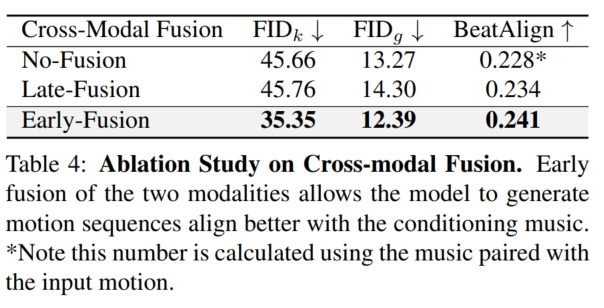

# AI Choreographer  

`2022/07/11&12`

AI Choreographer: Music Conditioned 3D Dance Generation with AIST++  

## 1.Motivation

However, dancing is a form of art that requires practice—even for humans, professional training is required to equip a dancer with a rich repertoire of dance motions to create an expressive choreography. 

Computationally, this is even more challenging as the task requires the ability to **generate a continuous motion with high kinematic(运动学上的) complexity that captures the non-linear relationship with the accompanying music.**  

## 2. Task

* present a new 3D dance dataset, AIST++, which contains 5:2 hours of 3D motion reconstructed from real dancers paired with music 
* AIST++数据集：目前规模最大且动作最丰富的3D人体关键点标注数据库，数据库针对10个流派的街舞，包含10,108,015帧从9个方位拍摄的人体图像，且配有对应的音乐，每帧图像都给出了对应的SMPL、2D关键点和3D关键点标记。

* a novel Full-Attention Cross-modal Transformer (FACT) network that can generate realistic 3D dance motion with global translation conditioned on music 
* Full Attention Cross-Modal Transformer model（FACT）：可以生成一段较长的与音乐吻合的3D舞蹈动作，其成功主要依赖于以下几个关键因素：
  - 在自回归模型中使用了全注意力机制
  - 对未来N帧的监督
  - 对两个模态信息较早的融合

## 3. Details

### 3.1 About the dataset AIST++

* Collection：generate the proposed 3D motion dataset from AIST Dance Database. 
* AIST:
  * a video set, no 3d information.
  * cameras are not calibrated, non-trival
  * no code base exist for this particular problem setup and running this pipeline on a large-scale video dataset requires non-trivial amount of compute and effort  

* AIST++
  * 9 views of camera intrinsic and extrinsic parameters;  
  * 17 COCO-format human joint locations in both 2D and 3D;
  * 24 SMPL pose parameters along with the global scaling and translation.
  * the largest 3D human dance dataset with 1408 sequences, 30 subjects and 10 dance genres  
  * 10 dance genres: Old School (Break, Pop, Lock and Waack) and New School (Middle Hip-hop, LA-style Hip-hop, House, Krump, Street Jazz and Ballet Jazz)

**补充：coco格式**

一共17个骨骼关节标注点，相关标注顺序以及关节名的对应可参考下表：

| 序号 |   关节名   | 中文名 |
| :--: | :--------: | :----: |
|  0   |    nose    |  鼻子  |
|  1   |   L eye    |  左眼  |
|  2   |   R eye    |  右眼  |
|  3   |   L ear    |  左耳  |
|  4   |   R ear    |  右耳  |
|  5   | L shoulder |  左肩  |
|  6   | R shoulder |  右肩  |
|  7   |  L elbow   | 左手肘 |
|  8   |  R elbow   | 右手肘 |
|  9   |  L wrist   | 左手腕 |
|  10  |  R wrist   | 右手腕 |
|  11  |   L hip    | 左臀部 |
|  12  |   R hip    | 右臀部 |
|  13  |   L knee   | 左膝盖 |
|  14  |   R knee   | 右膝盖 |
|  15  |  L ankle   | 左脚踝 |
|  16  |  R ankle   | 右脚踝 |

### 3.2 About the network FACT

* Describe：given a 2-second seed sample of motion represented as $X = (x_1,\cdots, x_T )$ and a longer conditioning music sequence represented as $Y = (y_1,\cdots , y_{T'})$, the problem is to generate a sequence of future motion $X' = (x_{T+1},\cdots, x_{T'}) $from time step $T + 1$ to $T'$, where $T' \gg T$.

* $$
  \begin{aligned}
  \mathbf{C} &=\mathrm{FF}(\operatorname{Attn}(\mathbf{Q}, \mathbf{K}, \mathbf{V}, \mathbf{M})) \\
  &=\mathrm{FF}\left(\operatorname{softmax}\left(\frac{\mathbf{Q} \mathbf{K}^{T}+\mathbf{M}}{\sqrt{D}}\right) \mathbf{V}\right) \\
  \mathbf{Q} &=\mathbf{X} \mathbf{W}^{Q}, \mathbf{K}=\mathbf{X} \mathbf{W}^{K}, \mathbf{V}=\mathbf{X} \mathbf{W}^{V}
  \end{aligned}
  $$

* 

![[公式]](https://www.zhihu.com/equation?tex=X) 首先被输入到motion transformer ![[公式]](https://www.zhihu.com/equation?tex=f_%7Bmot%7D) 中进行编码，而 ![[公式]](https://www.zhihu.com/equation?tex=Y) 则被输入到audio transformer ![[公式]](https://www.zhihu.com/equation?tex=f_%7Baudio%7D) 中进行编码，分别得到embedding向量 ![[公式]](https://www.zhihu.com/equation?tex=h_%7B1%3AT%7D%5E%7Bx%7D) 和 ![[公式]](https://www.zhihu.com/equation?tex=h_%7B1%3AT%27%7D%5E%7By%7D) 。

随后对 ![[公式]](https://www.zhihu.com/equation?tex=h_%7B1%3AT%7D%5E%7Bx%7D) 和 ![[公式]](https://www.zhihu.com/equation?tex=h_%7B1%3AT%27%7D%5E%7By%7D) 进行拼接，并输入到一个12层深的cross transformer ![[公式]](https://www.zhihu.com/equation?tex=f_%7Bcross%7D) 中，输出N帧的未来动作 ![[公式]](https://www.zhihu.com/equation?tex=X%27) ，其中三个transformer都是端到端的。

## 4. Experiment

### 4.1 Baseline

For **baselines**, we compare with the latest work on 3D dance generation that take music and seed motion as input, including **Dancenet** and **Li et al**. . 

For a more comprehensive evaluation we also compare with the recent state-of-the-art 2D dance generation method **DanceRevolution**.   We adapt this work to output 3D joint locations which can be directly compared with our results quantitatively, though joint locations do not allow immediate re-targeting.  

### 4.2 Details

* output of the model is the future motion sequence with N = 20 frames supervised by **L2 loss**  
* We use the publicly available audio processing toolbox Librosa [60] to extract the music features including: 1-dim envelope, 20-dim MFCC, 12-dim chroma, 1-dim one-hot peaks and 1-dim one-hot beats, resulting in **a 35-dim music feature.**  
* 9-dim rotation matrix representation for all 24 joints, along with a 3-dim global translation vector, resulting in a **219-dim motion feature.**   
* raw audio and motion features are first embedded into **800-dim hidden representations** with linear layers, then added with learnable **positional encoding**, before they were input into the transformer layers.  
* All the three (audio, motion, cross-modal) transformers have **10 attention heads with 800 hidden size.**  

* **disregard the last linear layer** in the audio/motion transformer and the **positional encoding in the cross-modal** transformer, as they are not necessary in the FACT model.  

## 5. Evaluation

**(1) motion quality**

* evaluate the generated motion quality by calculating the distribution distance between the generated and the ground-truth
  motions using **Frechet Inception Distance (FID)** on the extracted motion features.  

  (用的decoder是现成的)

* denote the  FID based on geometric and kinetic features as $FID_g$ and $FID_k$

**(2) generation diversity**

* The motion diversity in the geometric feature space and in the kinetic feature space are noted as $Dist_m$ and $Dist_k$  

**(3) motion-music correlation.**   

* propose a novel metric, Beat Alignment Score (BeatAlign), to evaluate the motion-music correlation in terms of the similarity between the kinematic beats and music beats.  
* The music beats are extracted using librosa and the kinematic beats are computed as the local minima of the kinetic velocity  

* $$
  \text { BeatAlign }=\frac{1}{m} \sum_{i=1}^{m} \exp \left(-\frac{\min _{\forall t_{j}^{y} \in B^{y}}\left\|t_{i}^{x}-t_{j}^{y}\right\|^{2}}{2 \sigma^{2}}\right)
  $$

* $B_x = {t_i^x}$ is the kinematic beats, $B_y = {t_j^y}$  is the music beats and `σ` is a parameter to normalize sequences  

## 6. Ablation Study  

(控制变量的工作)

### 6.1 Full-Attention Future-N Supervision  

Four different settings: 

* causalattention shift-by-1 supervision 
*  full-attention with future 1 supervision 
*  full-attention with future 10 supervision 
*  full-attention with future 20 supervision 

### 6.2 Early Cross-Modal Fusion  

(1) No-Fusion: 14-layer motion transformer only; 

(2) Late-Fusion: 13-layer motion/audio transformer with 1-layer cross-modal transformer; 

(3) Early-Fusion: 2- layer motion/audio transformer with 12-layer cross-modal transformer. 

